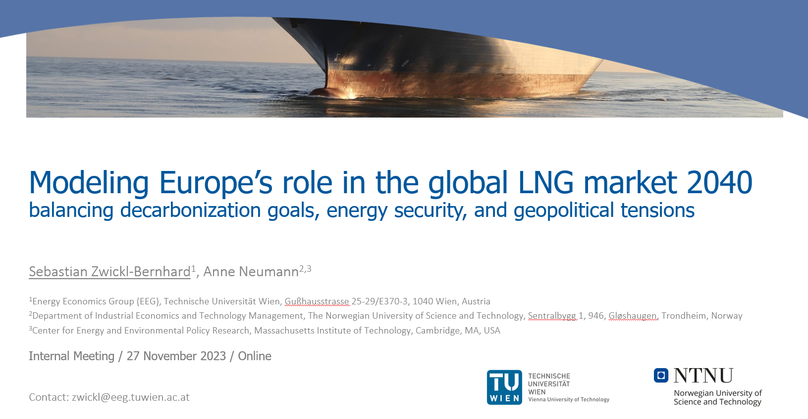

# Modeling Europe's role in the global LNG market 2040: balancing decarbonization goals, energy security, and geopolitical tensions

Copyright (c) 2024 Energy Economics Group (EEG), Technische Universität Wien, Sebastian Zwickl-Bernhard

This repository includes materials and methods of the paper submitted to _Energy_.

 
    

	

<be>

